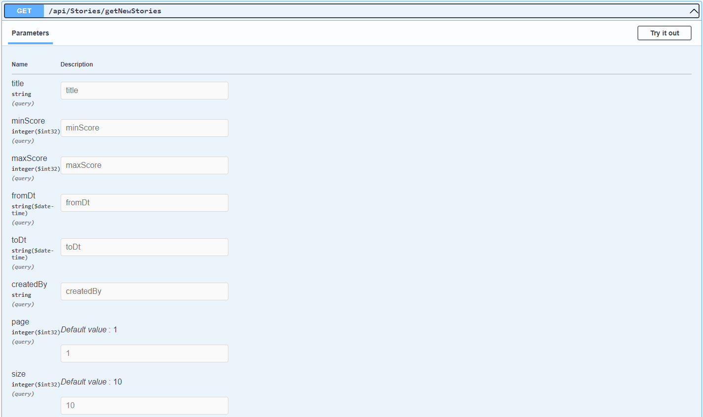

# Hacker News API

C# .NET Core back-end restful API that allows users to view the newest stories from the feed in https://github.com/HackerNews/API

## Table of Contents
- [Hacker News API](#hackernewsapi)
  - [Table of Contents](#table-of-contents)
  - [Introduction](#introduction)
  - [Features](#features)
  - [Installation](#installation)
  - [Usage](#usage)

## Introduction

This API is going to be consumed by an Angular front-end app. It returns the new stories from the feed and provides a search functionality.

## Features

The app has been implemented following Clean Architecture and CQRS.
The newstories endpoint is hit (https://hacker-news.firebaseio.com/v0/newstories.json?print=pretty). The app saves the data in cache using Polly, it also makes several api calls at the same time using .NET Tasks.
The solution also has a background service that calls **hacker-news.firebaseio.com** API each minute. When the story is in the cache , value is taken from the cache, but this process is important for adding new items to the cache, so that users always query stories from cache. 

**Technology**: .NET 6, MediatR, Polly, Tasks, BackgroundService, HttpClientFactory, AutoMapper, XUnit and Moq, Swagger.

### Installation

* Install .NET 6 SDK (https://dotnet.microsoft.com/en-us/download/dotnet/6.0) and Visual Studio 2022 or equivalent IDE.
* Clone this repo
* Open 'HackerNews.sln' in Visual Studio and start the application using 'Hackernews.Api' button. Or run **dotnet run HackerNews.Api.csproj**
* The URL is http://localhost:7012/swagger/index.html

## Usage

Main endpoint is **getNewStories**. You can search stories by title, score, date, createdBy and page/size.

